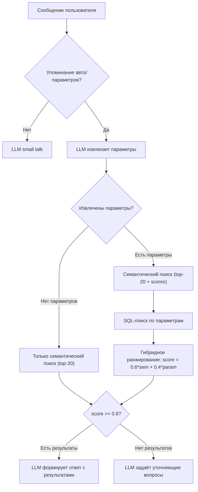

# Hybrid Search Algorithm

## Текущее состояние

Сейчас поиск работает так:

1. `vector_search_cars` возвращает топ-10 Car объектов **без** score косинусной близости
2. `_filter_cars_by_params` фильтрует топ-10 in-memory (жёсткий AND-фильтр, без ранжирования)
3. LLM сам оценивает релевантность >= 60% из оставшихся кандидатов

Этот подход теряет машины, которые не попали в топ-10 семантического поиска, но хорошо подходят по параметрам. Нет числового ранжирования.

## Целевой алгоритм



## Файл 1: `[carmatch-backend/src/services/vector_search.py](carmatch-backend/src/services/vector_search.py)`

**Основной файл изменений.** Добавляем 3 новых функции, модифицируем 1 существующую.

### 1.1 Модификация `vector_search_cars` -> `vector_search_cars_with_scores`

Новая функция (рядом с существующей) возвращает `list[tuple[Car, float]]` — пары (Car, cosine_similarity). Текущий SQL:

```sql
SELECT id FROM cars WHERE ...
ORDER BY embedding <=> CAST(:qv AS vector) LIMIT :lim
```

Новый SQL:

```sql
SELECT id, 1 - (embedding <=> CAST(:qv AS vector)) AS similarity
FROM cars
WHERE is_active = true AND embedding IS NOT NULL
ORDER BY embedding <=> CAST(:qv AS vector)
LIMIT :lim
```

- `limit` увеличиваем до 20 (вместо 10), чтобы больше кандидатов для ранжирования
- Старая `vector_search_cars` остаётся для обратной совместимости

### 1.2 Новая функция `sql_search_cars(db, params) -> list[Car]`

Строит динамический SQL WHERE из извлечённых параметров:

- `mark_name ILIKE '%<brand>%'` — текстовые поля, регистронезависимо
- `model_name ILIKE '%<model>%'`
- `country ILIKE '%<country>%'`
- `body_type` — с нормализацией через `_BODY_TYPE_MATCH` (как в `chat.py`)
- `fuel_type ILIKE '%<fuel_type>%'`
- `transmission` — с нормализацией (`автомат` -> `at`, etc.)
- `year BETWEEN year_val - 1 AND year_val + 1` — ±1 год
- `horsepower BETWEEN hp - 10% AND hp + 10%`
- `engine_volume` — допуск ±0.1

Все условия через AND. Лимит 50 записей. Только `is_active = true`.

### 1.3 Новая функция `compute_param_match_fraction(car, params) -> float`

Подсчитывает долю совпавших параметров:

- Считает сколько из non-null extracted params совпадают с полями car
- Возвращает `matched_count / total_non_null_params` (0.0 .. 1.0)
- Логика сопоставления аналогична SQL, но в Python (ILIKE -> `.lower() in`, year ±1, hp ±10%)

### 1.4 Новая функция `hybrid_rank(semantic_results, sql_car_ids, all_cars_map, params, w1=0.6, w2=0.4, threshold=0.6) -> list[tuple[Car, float]]`

- `semantic_results`: list of (Car, similarity_score) из шага 1.1
- `sql_car_ids`: set of car.id из шага 1.2
- Объединяет все уникальные car.id
- Для каждого авто: `score = w1 * semantic_sim + w2 * param_fraction`
  - `semantic_sim = 0` если не найден в семантическом поиске
  - `param_fraction` = `compute_param_match_fraction(car, params)`
- Фильтрует `score >= threshold`
- Сортирует по убыванию `score`
- Возвращает `list[tuple[Car, float]]`

## Файл 2: `[carmatch-backend/src/services/chat.py](carmatch-backend/src/services/chat.py)`

### 2.1 Рефакторинг `add_message` — блок поиска (строки ~610-640)

Текущий код (заменяется):

```python
search_results = vector_search_cars(db, query_text, limit=10)
search_results = _filter_cars_by_params(search_results, merged, ...)
```

Новый код:

```python
from src.services.vector_search import (
    vector_search_cars_with_scores, sql_search_cars, hybrid_rank
)

semantic_results = vector_search_cars_with_scores(db, query_text, limit=20)

has_params = any(v and str(v).strip() for v in merged.values())

if has_params:
    sql_cars = sql_search_cars(db, merged)
    ranked = hybrid_rank(semantic_results, sql_cars, merged)
else:
    # Нет параметров — только семантика, порог по similarity >= 0.6
    ranked = [(car, sim) for car, sim in semantic_results if sim >= 0.6]

search_results = [car for car, score in ranked]
```

### 2.2 Удаление `_filter_cars_by_params`

Функция `_filter_cars_by_params` (строки 219-278) больше не нужна — её заменяет `hybrid_rank`. Удаляем её и все вызовы.

### 2.3 Логика "нет результатов -> уточняющие вопросы"

Если `ranked` пуст (ни один авто не прошёл порог 0.6), вместо показа карточек LLM задаёт уточняющие вопросы. Используем уже существующий промпт `PROMPT_GENERATE_RESPONSE_CLARIFY`.

## Что НЕ меняется

- Путь 1 (small talk): `_is_greeting_only`, `_message_mentions_car_or_params`, `generate_response_small_talk` — без изменений
- Извлечение параметров: `extract_params`, `extract_params_fallback` — без изменений
- LLM-промпты для формирования ответа — без изменений
- Модели БД, схемы, роутеры — без изменений
- Старая `vector_search_cars` (без scores) — остаётся для совместимости
