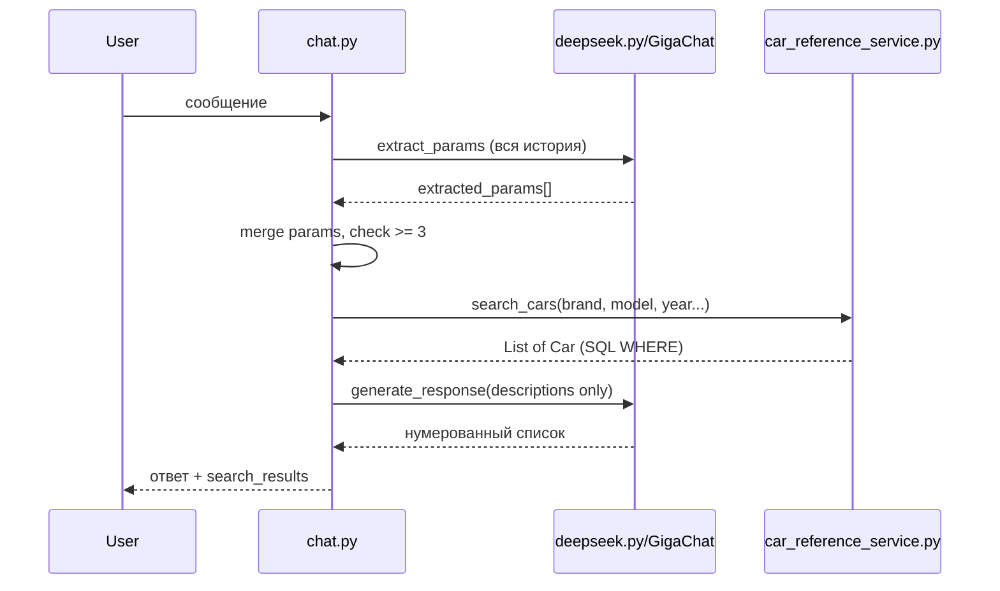
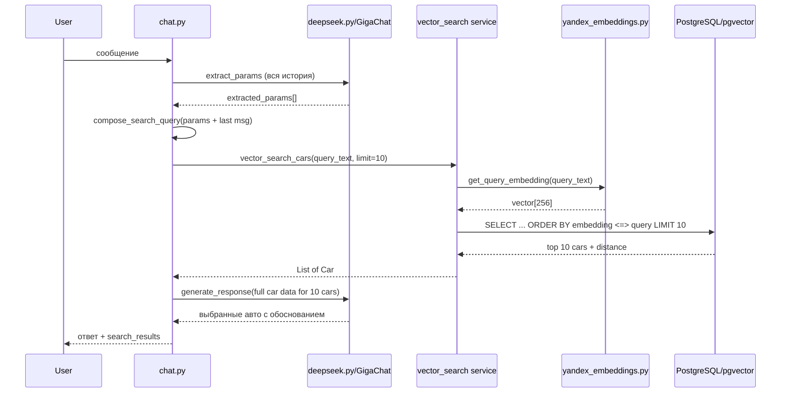

# RAG: Векторный поиск автомобилей в чат-flow

## Текущее состояние

Сейчас flow выглядит так:



**Проблемы:**

- SQL-поиск по точным фильтрам — если хотя бы один параметр неточный, результатов 0
- В LLM передаются только `description`, а не полные данные авто
- LLM не "выбирает" авто — просто форматирует то, что нашёл SQL

## Целевой flow (RAG)



## Изменения по файлам

### 1. Новый сервис: vector search для cars

**Файл:** [carmatch-backend/src/services/vector_search.py](carmatch-backend/src/services/vector_search.py) (новый)

Содержит:

- `compose_search_query(params: dict, last_user_message: str) -> str` — формирует текстовый запрос для эмбеддинга из накопленных параметров + последнего сообщения пользователя. Пример: `"Toyota Camry 2020 год, седан, бензин, автомат. Хочу надёжную машину для семьи"`
- `vector_search_cars(db: Session, query_text: str, limit: int = 10) -> list[Car]` — получает query embedding через `get_query_embedding()`, выполняет pgvector cosine search (`<=>`) по `cars.embedding`, возвращает top N объектов `Car`

Логика `vector_search_cars`:

1. Вызвать `get_query_embedding(query_text)` из [yandex_embeddings.py](carmatch-backend/src/services/yandex_embeddings.py)
2. Если embedding == None (Yandex API недоступен) — вернуть пустой список (fallback на SQL в chat.py)
3. Построить SQL: `SELECT * FROM cars WHERE is_active = true AND embedding IS NOT NULL ORDER BY embedding <=> CAST(:qv AS vector) LIMIT :lim`
4. Вернуть список объектов `Car`

### 2. Модификация chat.py — основной flow

**Файл:** [carmatch-backend/src/services/chat.py](carmatch-backend/src/services/chat.py)

В функции `add_message()` (строка ~173-198), **заменить** блок поиска:

**Было:** при `ready_for_search` -> `search_cars_service(db, brand=..., model=..., ...)`

**Стало:**

1. Сначала пробуем **векторный поиск**:

- Вызвать `compose_search_query(merged, last_user_message)` для формирования запроса
- Вызвать `vector_search_cars(db, query_text, limit=10)`

1. Если векторный поиск вернул результаты — используем их
2. Если векторный поиск вернул пустой список (API недоступен или нет embeddings) — **fallback на текущий SQL-поиск** `search_cars_service()`

Порог `MIN_PARAMS_FOR_SEARCH = 3` оставляем: векторный поиск запускается только когда собрано достаточно контекста для осмысленного запроса.

### 3. Модификация deepseek.py — новый промпт для RAG

**Файл:** [carmatch-backend/src/services/deepseek.py](carmatch-backend/src/services/deepseek.py)

#### 3a. Новый промпт `PROMPT_RAG_SELECT_CARS`

Заменяет `PROMPT_GENERATE_RESPONSE_WITH_RESULTS`. Суть:

> Ты — консультант по подбору автомобилей. Пользователь ищет автомобиль. Ниже приведены 10 автомобилей из нашей базы, наиболее подходящих по семантической близости к запросу пользователя. Для каждого автомобиля даны все доступные параметры.
>
> Твоя задача:
>
> 1. Проанализируй каждый автомобиль по критериям пользователя
> 2. Выбери от 1 до 5 наиболее подходящих
> 3. Представь их пользователю в виде нумерованного списка с кратким обоснованием, почему каждый подходит
> 4. Строго ЗАПРЕЩЕНО придумывать или добавлять автомобили, которых нет в списке ниже
>
> Список автомобилей из базы:
> CARS_DATA_PLACEHOLDER

#### 3b. Обновить `_format_car_for_prompt()` (уже существует, строка 474-516)

Функция уже формирует полные данные (марка, модель, год, кузов, цена, топливо, модификация, коробка, объём, мощность, описание, спеки). Она уже полностью подходит. Используем её для формирования данных о каждом автомобиле.

#### 3c. Обновить `generate_response()` (строка 531-618)

В ветке `if search_results:` (строка 545-567):

- Заменить вызов `_format_car_descriptions_for_llm()` на формирование блока с полными данными через `_format_car_for_prompt()` для каждого из 10 авто
- Использовать новый промпт `PROMPT_RAG_SELECT_CARS`

### 4. Файлы БЕЗ изменений

- [carmatch-backend/src/models.py](carmatch-backend/src/models.py) — колонка `embedding Vector(256)` уже добавлена
- [carmatch-backend/src/services/yandex_embeddings.py](carmatch-backend/src/services/yandex_embeddings.py) — `get_query_embedding()` уже готов
- [carmatch-backend/alembic/versions/8_add_cars_embedding_vector.py](carmatch-backend/alembic/versions/8_add_cars_embedding_vector.py) — миграция уже есть
- [carmatch-backend/scripts/populate_cars_embeddings.py](carmatch-backend/scripts/populate_cars_embeddings.py) — скрипт заполнения уже работает
- [carmatch-backend/src/config.py](carmatch-backend/src/config.py) — `yandex_folder_id` и `yandex_api_key` уже добавлены
- Роуты, схемы, модели — изменений не требуют

## Формирование поискового запроса (compose_search_query)

Ключевой момент — как из извлечённых параметров сформировать текст для эмбеддинга:

```python
def compose_search_query(params: dict, last_user_message: str = "") -> str:
    parts = []
    if params.get("brand"):
        parts.append(params["brand"])
    if params.get("model"):
        parts.append(params["model"])
    if params.get("body_type"):
        parts.append(params["body_type"])
    if params.get("year"):
        parts.append(f"{params['year']} год")
    if params.get("fuel_type"):
        parts.append(params["fuel_type"])
    if params.get("transmission"):
        parts.append(params["transmission"])
    if params.get("engine_volume"):
        parts.append(f"{params['engine_volume']} л")
    if params.get("horsepower"):
        parts.append(f"{params['horsepower']} л.с.")
    if params.get("modification"):
        parts.append(params["modification"])
    query = ", ".join(parts)
    # Добавляем контекст из последнего сообщения (обрезаем, чтобы не перегружать)
    if last_user_message:
        query += ". " + last_user_message[:200]
    return query.strip()
```

## Graceful degradation

- Если `YANDEX_FOLDER_ID` / `YANDEX_API_KEY` не заданы -> fallback на SQL
- Если Yandex API вернул ошибку -> fallback на SQL
- Если у всех cars `embedding IS NULL` (не заполнены) -> fallback на SQL
- Лог предупреждения при каждом fallback

## Acceptance Criteria

- При >= 3 параметрах выполняется векторный поиск по `cars.embedding`
- В LLM передаются полные данные (не только description) о 10 найденных авто
- LLM сам выбирает наиболее подходящие из 10 и объясняет выбор
- При недоступности Yandex API или пустых embeddings — автоматический fallback на SQL-поиск
- Существующий API контракт (`POST /chat/sessions/{id}/messages`) не меняется
