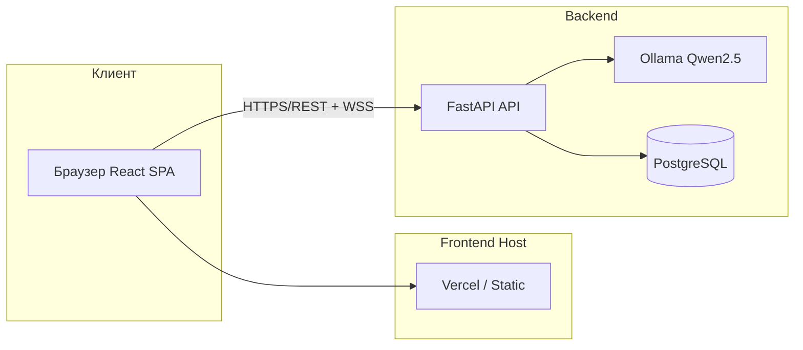
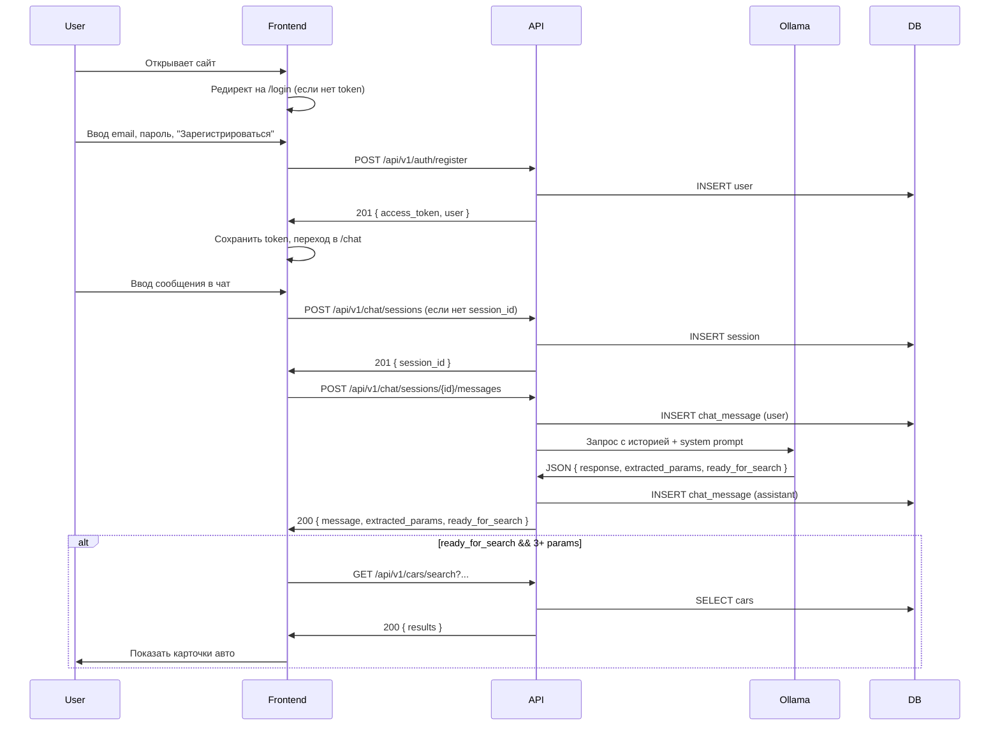
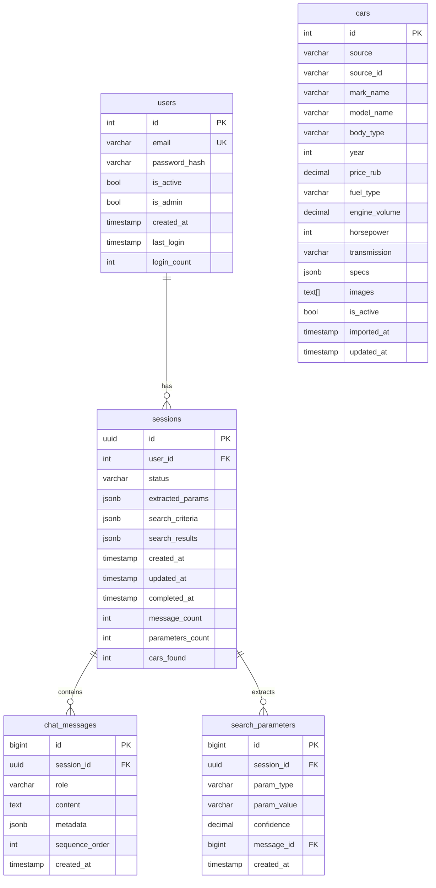

# CarMatch: Спецификация реализации для кодинг-агентов

Документ предназначен для реализации онлайн-сервиса CarMatch кодинг-агентами (Cursor, Claude, GPT). Каждая секция содержит однозначные контракты и атомарные задачи.

---

## 1. Executive Summary

**Задача:** Реализовать веб-сервис CarMatch — AI-консультант по подбору автомобилей с обязательной регистрацией, чат-интерфейсом на русском языке и подбором авто по параметрам, извлечённым из диалога.

**Ключевые ограничения:**
- Обязательная регистрация/авторизация; гостевой режим не предусмотрен.
- Каталог автомобилей для MVP — статический импорт из Yandex Auto Export (XML).
- AI-инференс для MVP — Ollama с моделью Qwen2.5 (локально или в контейнере бэкенда).
- Язык интерфейса и диалога — русский.

**Допущения:**
- Frontend и Backend развёртываются раздельно (например, Vercel + Render).
- БД — PostgreSQL (например, Supabase). Redis и Celery — опционально для MVP.
- JWT в заголовке `Authorization: Bearer <token>`; refresh-токены — на усмотрение реализации.

**Безопасность и валидация при регистрации/авторизации:**
- **Пароль:** минимум 8 символов (для MVP без требований к сложности: регистр, цифры, спецсимволы не обязательны). Валидация на бэкенде в Pydantic-схемах и при необходимости в auth service; при нарушении — ответ 422 с полем `detail` (например, `[{ "loc": ["body", "password"], "msg": "Пароль должен содержать минимум 8 символов" }]`).
- **Email:** валидный формат (стандартная валидация, например Pydantic `EmailStr`); при нарушении — 422.
- **Единственный источник токена на фронтенде:** AuthContext. При старте приложения AuthContext инициализирует `token` (и при необходимости `user`) из localStorage (ключ `carmatch_access_token`). Все запросы к API добавляют заголовок `Authorization: Bearer <token>` из текущего значения token в AuthContext; не читать token напрямую из localStorage в API-клиенте.

**Технологический стек:**
| Слой | Технология | Версия |
|------|------------|--------|
| Frontend | React | 18+ |
| Frontend | TypeScript | 5.x |
| Frontend | Vite | 5.x |
| Frontend | React Router | 6.x |
| Frontend | CSS Modules | — |
| Frontend | Axios + TanStack Query (React Query) | актуальные |
| Backend | FastAPI | 0.115+ |
| Backend | Python | 3.11+ |
| Backend | SQLAlchemy | 2.0 |
| Backend | Alembic | 1.x |
| Backend | PostgreSQL | 15+ |
| Backend | Ollama + Qwen2.5 | — |
| Auth | JWT, bcrypt | — |

---

## 2. Архитектурные диаграммы

### 2.1. Общая схема системы (flowchart)



### 2.2. Сценарий: регистрация → чат → подбор (sequenceDiagram)



### 2.3. Модель данных (erDiagram)



---

## 3. Структура компонентов

### 3.1. Frontend (carmatch-frontend)

| Компонент | Ответственность | Входы | Выходы | Файлы/пути | Зависимости |
|-----------|-----------------|-------|--------|------------|-------------|
| **AuthPage** | Экран входа и регистрации; отправка credentials на API; при успехе — вызов AuthContext.login/register с данными ответа, редирект в /chat | — | Рендер формы, вызов API | `src/pages/AuthPage.tsx`, `src/pages/AuthPage.module.css` | React Router, AuthContext, API client |
| **ProtectedRoute** | Проверка наличия JWT; редирект на /login при отсутствии. Токен берётся только из AuthContext (не из localStorage напрямую) | `children`; внутри использует `token` из AuthContext | Рендер `children` или `<Navigate to="/login" />` | `src/components/ProtectedRoute.tsx` | React Router, AuthContext |
| **ChatLayout** | Область чата: сайдбар с «Новый диалог» и списком сессий, область сообщений, поле ввода | `sessionId`, `sessions`, `messages` | Рендер layout | `src/components/ChatLayout/ChatLayout.tsx`, `ChatLayout.module.css` | React Router, API-клиент |
| **ChatSidebar** | Список сессий пользователя, кнопка «Новый диалог», выход | `sessions[]`, `currentSessionId`, `onNewChat`, `onSelectSession`, `onLogout` | Рендер списка и кнопок | `src/components/ChatLayout/ChatSidebar.tsx` | — |
| **MessageList** | Отображение сообщений user/assistant по порядку `sequence_order` | `messages[]` | Рендер списка сообщений | `src/components/Chat/MessageList.tsx` | — |
| **MessageInput** | Поле ввода и кнопка «Отправить»; вызов API отправки сообщения | `sessionId`, `onSend`, `disabled` | Рендер input + кнопка | `src/components/Chat/MessageInput.tsx` | — |
| **CarResults** | Карточки подобранных автомобилей (марка, модель, год, цена, фото) | `cars[]` из API | Рендер сетки карточек | `src/components/CarResults/CarResults.tsx`, `CarCard.tsx` | — |
| **authApi** | Регистрация, логин; возврат access_token и user. Вызывающий код (AuthPage) передаёт результат в AuthContext.login/register — сохранение token в state и localStorage выполняет только AuthContext | `email`, `password` | Promise<{ access_token, user }> | `src/api/auth.ts` | API client (axios), env VITE_API_BASE_URL |
| **chatApi** | Создание сессии, отправка сообщения, получение истории сообщений | `sessionId?`, `content?` | Promise<session \| message \| messages[]> | `src/api/chat.ts` | API client (токен подставляется интерцептором из AuthContext) |
| **carsApi** | Поиск автомобилей по query-параметрам | `params: { budget_max?, body_type?, ... }` | Promise<{ count, results }> | `src/api/cars.ts` | API client |
| **AuthContext** | Единственный источник истины для token и user. При монтировании — восстановление token (и при необходимости user) из localStorage (ключ `carmatch_access_token`). Методы login/register сохраняют переданные access_token и user в state и в localStorage; logout очищает state и localStorage | — | Context: { user, token, login, logout, register } | `src/contexts/AuthContext.tsx` | React |
| **App router** | Маршруты: /login → AuthPage; /chat, /chat/:sessionId? → ProtectedRoute → ChatLayout | — | Router с маршрутами | `src/App.tsx` | React Router |

### 3.2. Backend (carmatch-backend)

| Компонент | Ответственность | Входы | Выходы | Файлы/пути | Зависимости |
|-----------|-----------------|-------|--------|------------|-------------|
| **auth router** | POST /register, POST /login; выдача JWT | Body: email, password | 201/400/422 + access_token, user | `src/routers/auth.py` | FastAPI, schemas, auth service |
| **auth service** | Хеширование пароля (bcrypt), проверка пароля, создание JWT | email, password (plain) | User + token или None | `src/services/auth.py` | bcrypt, jwt, database |
| **chat router** | POST /chat/sessions, POST /chat/sessions/{id}/messages, GET /chat/sessions/{id}/messages, GET /chat/sessions | JWT, body/path | 201/200 + session или message(s) | `src/routers/chat.py` | FastAPI, get_current_user, chat service, ollama client |
| **chat service** | Создание сессии, добавление сообщения user, вызов Ollama, сохранение ответа assistant, обновление extracted_params в session | user_id, session_id, content | Session, Message | `src/services/chat.py` | database, ollama client |
| **ollama client** | Запрос к Ollama API с system prompt и историей; парсинг JSON ответа (response, extracted_params, ready_for_search) | messages[], system_prompt | dict с response, extracted_params, ready_for_search | `src/services/ollama_client.py` | httpx, OLLAMA_URL |
| **cars router** | GET /cars/search с query-параметрами; фильтрация по БД | Query: budget_max, body_type, min_year, fuel_type, limit | 200 { count, results } | `src/routers/cars.py` | FastAPI, get_current_user, database |
| **users/cars/sessions/models** | SQLAlchemy модели для users, cars, sessions, chat_messages, search_parameters | — | — | `src/models.py` | SQLAlchemy |
| **schemas** | Pydantic-модели для request/response | — | — | `src/schemas.py` | Pydantic |
| **database** | Подключение к PostgreSQL, session factory | DATABASE_URL | Session | `src/database.py` | SQLAlchemy, os |
| **middleware/deps** | get_current_user: извлечение JWT из Authorization, проверка, возврат User | Header Authorization | User или 401 | `src/deps.py` или в `auth.py` | FastAPI Depends, jwt |
| **main** | Сборка FastAPI app, подключение роутеров, CORS | — | FastAPI app | `main.py` | FastAPI, routers |

---

## 4. API и интерфейсы

Базовый URL API: `https://api.carmatch.app/v1` или для разработки: `http://localhost:8000/api/v1`. Все защищённые эндпоинты требуют заголовок: `Authorization: Bearer <access_token>`.

### 4.1. Авторизация

**Валидация входных данных (общая для register и login):**
- **email** — обязательное поле, формат email (например, Pydantic `EmailStr`). При нарушении — 422, в `detail` указать причину (например, `"Некорректный формат email"`).
- **password** — обязательное поле, минимум 8 символов. При нарушении — 422, в `detail` указать (например, `"Пароль должен содержать минимум 8 символов"`).

**Хранение пароля на бэкенде:** только хеш (bcrypt с солью). В ответах API и в логах пароль никогда не возвращается и не выводится.

#### POST /api/v1/auth/register

**Request:**
```json
{
  "email": "user@example.com",
  "password": "securepassword123"
}
```

**Response 201:**
```json
{
  "access_token": "eyJhbGciOiJIUzI1NiIsInR5cCI6IkpXVCJ9...",
  "token_type": "bearer",
  "user": {
    "id": 1,
    "email": "user@example.com",
    "is_active": true,
    "created_at": "2026-01-27T12:00:00Z"
  }
}
```

**Коды ошибок:**
- **400** — email уже зарегистрирован. Тело ответа: `{ "detail": "Email уже зарегистрирован" }` (или аналогичное сообщение).
- **422** — ошибка валидации (некорректный формат email, пароль короче 8 символов). Тело: массив ошибок в формате FastAPI, например `[{ "loc": ["body", "password"], "msg": "Пароль должен содержать минимум 8 символов", "type": "value_error" }]`.

**TypeScript (frontend):**
```ts
interface RegisterRequest {
  email: string;
  password: string;
}
interface AuthUser {
  id: number;
  email: string;
  is_active: boolean;
  created_at: string;
}
interface AuthResponse {
  access_token: string;
  token_type: string;
  user: AuthUser;
}
```

---

#### POST /api/v1/auth/login

**Request:** тот же что и register (email, password). Валидация формата email и длины пароля — как для register.

**Response 200:** тот же формат что и AuthResponse выше.

**Коды ошибок:**
- **401** — неверный email или пароль. Тело ответа: `{ "detail": "Неверный email или пароль" }`. Не раскрывать, что именно неверно (email или пароль).
- **422** — ошибка валидации (формат email, длина пароля); формат `detail` — как для register.

---

### 4.2. Чат-сессии

#### POST /api/v1/chat/sessions

**Request:** тело пустое или `{}`. Заголовок: `Authorization: Bearer <token>`.

**Response 201:**
```json
{
  "id": "550e8400-e29b-41d4-a716-446655440000",
  "user_id": 1,
  "status": "active",
  "extracted_params": {},
  "search_results": [],
  "created_at": "2026-01-27T12:00:00Z",
  "updated_at": "2026-01-27T12:00:00Z"
}
```

**TypeScript:**
```ts
interface ChatSession {
  id: string;
  user_id: number;
  status: 'active' | 'completed' | 'cancelled' | 'error';
  extracted_params: Record<string, unknown>;
  search_results: unknown[];
  created_at: string;
  updated_at: string;
}
```

---

#### GET /api/v1/chat/sessions

**Response 200:**
```json
{
  "sessions": [
    {
      "id": "uuid",
      "status": "active",
      "created_at": "...",
      "updated_at": "...",
      "message_count": 5
    }
  ]
}
```

Список только сессий текущего пользователя, упорядоченный по `updated_at` DESC.

---

#### POST /api/v1/chat/sessions/{session_id}/messages

**Request:**
```json
{
  "content": "Нужна машина для города до 2 миллионов"
}
```

**Response 200:**
```json
{
  "id": 123,
  "session_id": "uuid",
  "role": "assistant",
  "content": "Понял! Какой тип кузова предпочитаете: седан, хэтчбек, внедорожник?",
  "sequence_order": 2,
  "created_at": "...",
  "extracted_params": [
    { "type": "budget_max", "value": "2000000", "confidence": 0.95 }
  ],
  "ready_for_search": false
}
```

После сохранения сообщения пользователя бэкенд вызывает Ollama, сохраняет ответ assistant и возвращает его вместе с извлечёнными параметрами и флагом `ready_for_search`. Если `ready_for_search === true` и параметров достаточно (например, ≥3), фронтенд может вызвать GET /cars/search.

**Коды ошибок:** 404 (сессия не найдена или не принадлежит пользователю), 422 (пустой content).

**TypeScript:**
```ts
interface SendMessageRequest {
  content: string;
}
interface ExtractedParam {
  type: string;
  value: string;
  confidence: number;
}
interface SendMessageResponse {
  id: number;
  session_id: string;
  role: 'user' | 'assistant' | 'system';
  content: string;
  sequence_order: number;
  created_at: string;
  extracted_params?: ExtractedParam[];
  ready_for_search?: boolean;
}
```

---

#### GET /api/v1/chat/sessions/{session_id}/messages

**Response 200:**
```json
{
  "messages": [
    {
      "id": 1,
      "session_id": "uuid",
      "role": "user",
      "content": "Нужна машина для города",
      "sequence_order": 1,
      "created_at": "..."
    },
    {
      "id": 2,
      "session_id": "uuid",
      "role": "assistant",
      "content": "Понял! Какой бюджет?",
      "sequence_order": 2,
      "created_at": "..."
    }
  ]
}
```

---

### 4.3. Поиск автомобилей

#### GET /api/v1/cars/search

**Query-параметры:**

| Параметр | Тип | Обязательный | Описание |
|----------|-----|--------------|----------|
| budget_max | number | нет | Максимальная цена (руб.) |
| body_type | string | нет | Седан, suv, хэтчбек, универсал и т.д. |
| min_year | number | нет | Минимальный год выпуска |
| fuel_type | string | нет | Бензин, дизель, гибрид, электро |
| transmission | string | нет | Автомат, механика |
| limit | number | нет | Макс. количество (по умолчанию 10, макс. 50) |

**Response 200:**
```json
{
  "count": 3,
  "results": [
    {
      "id": 1,
      "mark_name": "Toyota",
      "model_name": "RAV4",
      "year": 2022,
      "price_rub": 2100000,
      "body_type": "suv",
      "fuel_type": "hybrid",
      "transmission": "автомат",
      "images": ["https://..."],
      "engine_volume": 2.5,
      "horsepower": 218
    }
  ]
}
```

**TypeScript:**
```ts
interface CarSearchParams {
  budget_max?: number;
  body_type?: string;
  min_year?: number;
  fuel_type?: string;
  transmission?: string;
  limit?: number;
}
interface CarResult {
  id: number;
  mark_name: string;
  model_name: string;
  year: number;
  price_rub: number;
  body_type: string | null;
  fuel_type: string | null;
  transmission: string | null;
  images: string[];
  engine_volume?: number;
  horsepower?: number;
}
interface CarSearchResponse {
  count: number;
  results: CarResult[];
}
```

**Коды ошибок:** 401 (нет токена), 422 (некорректные параметры).

---

### 4.4. Примеры запросов (curl)

```bash
# Регистрация
curl -X POST http://localhost:8000/api/v1/auth/register \
  -H "Content-Type: application/json" \
  -d '{"email":"user@example.com","password":"securepassword123"}'

# Создание сессии (подставить TOKEN)
curl -X POST http://localhost:8000/api/v1/chat/sessions \
  -H "Authorization: Bearer TOKEN" \
  -H "Content-Type: application/json"

# Отправка сообщения (подставить SESSION_ID и TOKEN)
curl -X POST "http://localhost:8000/api/v1/chat/sessions/SESSION_ID/messages" \
  -H "Authorization: Bearer TOKEN" \
  -H "Content-Type: application/json" \
  -d '{"content":"Машина для города до 2 млн"}'

# Поиск авто
curl "http://localhost:8000/api/v1/cars/search?budget_max=2000000&limit=5" \
  -H "Authorization: Bearer TOKEN"
```

---

## 5. Модель данных

### 5.1. Таблицы (полные DDL)

Исходное ТЗ: `carmatch-frontend/CarMatch_doc.md`, раздел 3. Ниже — сводка и полные DDL для всех таблиц.

**users**
```sql
CREATE TABLE users (
    id SERIAL PRIMARY KEY,
    email VARCHAR(255) UNIQUE NOT NULL,
    password_hash VARCHAR(255) NOT NULL,
    is_active BOOLEAN DEFAULT true,
    is_admin BOOLEAN DEFAULT false,
    created_at TIMESTAMP DEFAULT NOW(),
    last_login TIMESTAMP,
    login_count INTEGER DEFAULT 0
);
CREATE INDEX idx_users_email ON users(email);
CREATE INDEX idx_users_created_at ON users(created_at);
```

**sessions**
```sql
CREATE TABLE sessions (
    id UUID PRIMARY KEY DEFAULT gen_random_uuid(),
    user_id INTEGER NOT NULL REFERENCES users(id) ON DELETE CASCADE,
    status VARCHAR(20) DEFAULT 'active' CHECK (status IN ('active', 'completed', 'cancelled', 'error')),
    extracted_params JSONB DEFAULT '{}',
    search_criteria JSONB DEFAULT '{}',
    search_results JSONB DEFAULT '[]',
    created_at TIMESTAMP DEFAULT NOW(),
    updated_at TIMESTAMP DEFAULT NOW(),
    completed_at TIMESTAMP,
    message_count INTEGER DEFAULT 0,
    parameters_count INTEGER DEFAULT 0,
    cars_found INTEGER DEFAULT 0
);
CREATE INDEX idx_sessions_user_id ON sessions(user_id);
CREATE INDEX idx_sessions_status ON sessions(status);
CREATE INDEX idx_sessions_created_at ON sessions(created_at);
```

**chat_messages**
```sql
CREATE TABLE chat_messages (
    id BIGSERIAL PRIMARY KEY,
    session_id UUID NOT NULL REFERENCES sessions(id) ON DELETE CASCADE,
    role VARCHAR(20) NOT NULL CHECK (role IN ('user', 'assistant', 'system')),
    content TEXT NOT NULL,
    metadata JSONB DEFAULT '{}',
    sequence_order INTEGER NOT NULL,
    created_at TIMESTAMP DEFAULT NOW()
);
CREATE INDEX idx_chat_messages_session_id ON chat_messages(session_id);
CREATE INDEX idx_chat_messages_sequence ON chat_messages(session_id, sequence_order);
```

**search_parameters**
```sql
CREATE TABLE search_parameters (
    id BIGSERIAL PRIMARY KEY,
    session_id UUID NOT NULL REFERENCES sessions(id) ON DELETE CASCADE,
    param_type VARCHAR(50) NOT NULL,
    param_value VARCHAR(255),
    confidence DECIMAL(3,2) CHECK (confidence >= 0 AND confidence <= 1),
    message_id BIGINT REFERENCES chat_messages(id) ON DELETE SET NULL,
    created_at TIMESTAMP DEFAULT NOW()
);
CREATE INDEX idx_search_parameters_session_id ON search_parameters(session_id);
```

**cars**
```sql
CREATE TABLE cars (
    id SERIAL PRIMARY KEY,
    source VARCHAR(20) NOT NULL DEFAULT 'yandex',
    source_id VARCHAR(100),
    mark_name VARCHAR(100) NOT NULL,
    model_name VARCHAR(100) NOT NULL,
    body_type VARCHAR(50),
    year INTEGER CHECK (year BETWEEN 1990 AND EXTRACT(YEAR FROM NOW()) + 1),
    price_rub DECIMAL(12,2) CHECK (price_rub > 0),
    fuel_type VARCHAR(30),
    engine_volume DECIMAL(4,2),
    horsepower INTEGER,
    transmission VARCHAR(30),
    specs JSONB DEFAULT '{}',
    images TEXT[],
    description TEXT,
    is_active BOOLEAN DEFAULT true,
    imported_at TIMESTAMP DEFAULT NOW(),
    updated_at TIMESTAMP DEFAULT NOW()
);
CREATE INDEX idx_cars_mark_model ON cars(mark_name, model_name);
CREATE INDEX idx_cars_year ON cars(year);
CREATE INDEX idx_cars_price ON cars(price_rub);
CREATE INDEX idx_cars_body_type ON cars(body_type);
CREATE INDEX idx_cars_fuel_type ON cars(fuel_type);
CREATE INDEX idx_cars_is_active ON cars(is_active) WHERE is_active = true;
```

### 5.2. Связи и каскады

- Удаление пользователя → каскадное удаление его сессий (и при необходимости сообщений и search_parameters, если не задано иначе через FK).
- Сессия принадлежит одному пользователю. Сообщения и search_parameters принадлежат одной сессии.

---

## 6. План реализации (Implementation Checklist)

Задачи сгруппированы так, чтобы агент мог выполнять их по одной. Порядок соблюдать по зависимостям.

### Backend

- [ ] **B1.** Создать `carmatch-backend/requirements.txt` с зависимостями: fastapi, uvicorn, sqlalchemy>=2.0, alembic, psycopg2-binary, pydantic, pydantic-settings, python-jose[cryptography], passlib[bcrypt], httpx, python-multipart.
- [ ] **B2.** Создать `carmatch-backend/src/database.py`: подключение к PostgreSQL по переменной окружения DATABASE_URL, создание engine и sessionmaker (SessionLocal), контекстный менеджер get_db().
- [ ] **B3.** Создать `carmatch-backend/src/models.py`: модели SQLAlchemy для User, Session, ChatMessage, Car, SearchParameter с полями и связями по разделу 5.
- [ ] **B4.** Создать первую миграцию Alembic: добавление таблиц users, sessions, chat_messages, cars, search_parameters. Команда: `alembic revision --autogenerate -m "initial"`, затем `alembic upgrade head`.
- [ ] **B5.** Создать `carmatch-backend/src/schemas.py`: Pydantic-модели для RegisterRequest, LoginRequest, AuthResponse, UserResponse, ChatSessionResponse, MessageCreate, MessageResponse, CarSearchResponse, CarResult; при необходимости — для списков (sessions list, messages list). Для RegisterRequest и LoginRequest задать валидацию: email — EmailStr (или аналог с форматом email); password — min_length=8 (сообщение об ошибке: «Пароль должен содержать минимум 8 символов»).
- [ ] **B6.** Создать `carmatch-backend/src/services/auth.py`: функции hash_password(password) — bcrypt с солью, verify_password(plain, hashed), create_access_token(user_id, email), get_user_by_email(db, email); регистрация (проверка существования email — при наличии возвращать None или флаг «email занят»; создание User с хешем пароля, возврат token и user); логин (проверка пароля через verify_password — при неверном пароле возвращать None; при успехе — token и user).
- [ ] **B7.** Создать `carmatch-backend/src/deps.py`: зависимость get_current_user(credentials: HTTPAuthorizationCredentials, db: Session) — извлечение JWT из Bearer, верификация подписи и срока действия, загрузка User из БД по id из payload; при отсутствии/невалидном токене или несуществующем пользователе — HTTPException 401 с сообщением «Неверный или истёкший токен» (или аналог).
- [ ] **B8.** Создать `carmatch-backend/src/routers/auth.py`: POST /api/v1/auth/register и POST /api/v1/auth/login; вызов auth service; при регистрации: если email уже занят — 400 с detail «Email уже зарегистрирован»; при нарушении валидации Pydantic — 422 с detail из FastAPI; при успехе — 201 и AuthResponse. При логине: при неверном email или пароле — 401 с detail «Неверный email или пароль»; при 422 — как для register; при успехе — 200 и AuthResponse.
- [ ] **B9.** Создать `carmatch-backend/main.py`: экземпляр FastAPI, CORS middleware (разрешить origin фронтенда), подключение роутеров auth и (ниже) chat, cars; точка входа uvicorn.
- [ ] **B10.** Создать `carmatch-backend/src/services/ollama_client.py`: функция get_ollama_response(messages: list[dict], system_prompt: str) -> dict. POST к OLLAMA_URL (например http://localhost:11434/api/chat) с телом { "model": "qwen2.5", "messages": [...], "stream": false }. В ответе парсить JSON от модели (response, extracted_params, ready_for_search); при отсутствии полей — задать значения по умолчанию. System prompt — из константы или конфига (текст из раздела 5.1 CarMatch_doc.md).
- [ ] **B11.** Создать `carmatch-backend/src/services/chat.py`: create_session(db, user_id) → Session; add_message(db, session_id, user_id, content) → (Message, assistant_message, extracted_params, ready_for_search): сохранить user message, вызвать ollama_client с историей сообщений сессии, сохранить assistant message, обновить session.extracted_params и при необходимости search_results, вернуть assistant message и метаданные.
- [ ] **B12.** Создать `carmatch-backend/src/routers/chat.py`: POST /api/v1/chat/sessions (get_current_user), GET /api/v1/chat/sessions, POST /api/v1/chat/sessions/{session_id}/messages (body: content), GET /api/v1/chat/sessions/{session_id}/messages; проверка владения сессией пользователем.
- [ ] **B13.** Создать `carmatch-backend/src/routers/cars.py`: GET /api/v1/cars/search с query-параметрами budget_max, body_type, min_year, fuel_type, transmission, limit; фильтрация по таблице cars (is_active=true), сортировка (например по price_rub ASC), limit по умолчанию 10, макс. 50; ответ в формате { count, results }.
- [ ] **B14.** Подключить роутеры chat и cars в main.py под префиксом /api/v1.
- [ ] **B15.** Реализовать скрипт или команду импорта каталога из Yandex Auto Export XML в таблицу cars (парсинг XML, маппинг полей, batch insert). URL XML: https://auto-export.s3.yandex.net/auto/price-list/catalog/cars.xml (или локальный файл cars.xml).

### Frontend

- [ ] **F1.** Убедиться, что в проекте есть зависимости: react, react-dom, react-router-dom, axios, @tanstack/react-query, typescript, vite. Добавить при необходимости в package.json и установить.
- [ ] **F2.** Создать `src/api/client.ts`: экземпляр axios с baseURL из import.meta.env.VITE_API_BASE_URL; интерцептор request — добавлять заголовок `Authorization: Bearer <token>`, где token берётся **только из AuthContext** (единственный источник). Поскольку client.ts не имеет доступа к React-контексту напрямую, реализовать одним из способов: (a) передавать в client функцию getToken() при создании (например, из AuthContext при инициализации приложения), либо (b) экспортировать из client метод setAuthToken(token) и вызывать его из AuthContext при login/register/logout, храня токен также в замыкании или переменной модуля client. Не читать token напрямую из localStorage в client.
- [ ] **F3.** Создать `src/api/auth.ts`: функции register(email, password), login(email, password); вызов POST /api/v1/auth/register и POST /api/v1/auth/login через client; возврат данных ответа (access_token, user). Вызывающий код (AuthPage) после успешного ответа передаёт access_token и user в AuthContext.login или AuthContext.register — сохранение в state и localStorage выполняет только AuthContext.
- [ ] **F4.** Создать `src/api/chat.ts`: createSession(), getSessions(), getMessages(sessionId), sendMessage(sessionId, content); все запросы через client с токеном.
- [ ] **F5.** Создать `src/api/cars.ts`: searchCars(params: CarSearchParams); GET /api/v1/cars/search с query-параметрами.
- [ ] **F6.** Создать `src/contexts/AuthContext.tsx`: единственный источник истины для token и user. При монтировании провайдера — восстановление token из localStorage (ключ `carmatch_access_token`); при необходимости восстанавливать user из localStorage (ключ `carmatch_user`) или загружать по токену. Методы login(access_token, user), register(access_token, user) сохраняют переданные данные в state и в localStorage; logout очищает state и localStorage (и при использовании F2(b) — сбрасывает токен в client). Провайдер оборачивает приложение (например, корень Router).
- [ ] **F7.** Создать `src/components/ProtectedRoute.tsx`: читать token только из AuthContext (useContext(AuthContext).token); при отсутствии token — <Navigate to="/login" replace />, иначе — <Outlet /> или children.
- [ ] **F8.** Создать `src/pages/AuthPage.tsx`: форма с полями email и password; кнопки «Войти» и «Зарегистрироваться»; вызов authApi.login/register, при успехе — вызов AuthContext.login или AuthContext.register с access_token и user из ответа (AuthContext сам сохраняет в state и localStorage); затем редирект на /chat. Стили в AuthPage.module.css. Опционально: клиентская валидация пароля (минимум 8 символов) и формата email перед отправкой.
- [ ] **F9.** Создать `src/pages/ChatPage.tsx`: при открытии /chat без sessionId — создать сессию через createSession() и редирект на /chat/:sessionId; при наличии sessionId — загрузка сообщений getMessages(sessionId), рендер ChatLayout с MessageList и MessageInput.
- [ ] **F10.** Создать `src/components/ChatLayout/ChatLayout.tsx` и `ChatLayout.module.css`: сайдбар слева (список сессий + «Новый диалог» + «Выйти»), справа — область сообщений и поле ввода; пропсы: sessionId, sessions, messages, onNewChat, onSelectSession, onSend, onLogout.
- [ ] **F11.** Создать `src/components/Chat/MessageList.tsx`: отображение сообщений по sequence_order; различие стилей для role user и assistant.
- [ ] **F12.** Создать `src/components/Chat/MessageInput.tsx`: контролируемый input и кнопка «Отправить»; при отправке вызвать onSend(content), затем обновить список сообщений (через refetch или передачу нового сообщения в state).
- [ ] **F13.** В ChatPage: при ответе sendMessage с ready_for_search === true и достаточным количеством extracted_params вызвать searchCars(extracted_params) и отобразить блок CarResults под сообщениями.
- [ ] **F14.** Создать `src/components/CarResults/CarResults.tsx` и `CarCard.tsx`: сетка карточек; каждая карточка: mark_name, model_name, year, price_rub, при наличии — первое изображение из images; стили в CSS Modules.
- [ ] **F15.** Настроить маршруты в App.tsx: /login → AuthPage; /chat и /chat/:sessionId обёрнуты в ProtectedRoute, рендер ChatPage; по умолчанию редирект с / на /chat или /login в зависимости от токена.
- [ ] **F16.** Добавить в .env.example переменную VITE_API_BASE_URL=http://localhost:8000 (или URL бэкенда).

---

## 7. Acceptance Criteria

- ✅ Пользователь может зарегистрироваться по email и паролю и получить JWT; при повторной регистрации с тем же email возвращается 400 с сообщением «Email уже зарегистрирован».
- ✅ При регистрации с паролем короче 8 символов API возвращает 422 с описанием ошибки валидации (например, «Пароль должен содержать минимум 8 символов»).
- ✅ При регистрации или входе с некорректным форматом email API возвращает 422 с описанием ошибки.
- ✅ Пользователь может войти по email и паролю и получить JWT; при неверных данных возвращается 401 с сообщением «Неверный email или пароль» (без раскрытия, что именно неверно).
- ✅ Без токена доступ к /chat и к API (кроме register/login) невозможен; фронтенд берёт токен из AuthContext и перенаправляет на /login при отсутствии токена.
- ✅ После входа пользователь попадает в чат; при первом заходе создаётся новая сессия и отображается пустой список сообщений.
- ✅ Пользователь вводит сообщение и нажимает «Отправить»; сообщение отображается в чате; ответ ассистента появляется после ответа API (с задержкой вызова Ollama).
- ✅ В ответе API сообщения присутствуют поля extracted_params и ready_for_search; при ready_for_search и достаточном числе параметров фронтенд показывает блок с результатами поиска автомобилей.
- ✅ GET /cars/search с параметрами (budget_max, body_type и т.д.) возвращает список автомобилей из БД в формате { count, results }; результаты отображаются в виде карточек (марка, модель, год, цена, при наличии — фото).
- ✅ В сайдбаре отображается список сессий пользователя; можно создать «Новый диалог» и переключаться между сессиями; при выборе сессии подгружаются её сообщения.
- ✅ Пользователь может выйти (logout); AuthContext очищает token и user из state и из localStorage; при использовании F2(b) токен сбрасывается и в API-клиенте; происходит редирект на /login.
- ✅ Каталог автомобилей заполняется из Yandex Auto Export (или локального XML); поиск по фильтрам возвращает только активные записи cars.

---

## 8. Риски и альтернативы

| Риск | Митигация |
|------|-----------|
| Ограничения бесплатного хостинга (Render/Vercel/Supabase) | Мониторить лимиты; при достижении лимитов рассмотреть платный tier или перенос на другой провайдер. |
| Долгий ответ Ollama (>4 сек) | Кэшировать типовые ответы; сократить длину контекста; в UI показывать индикатор загрузки. |
| Нестабильный формат JSON от LLM | Парсить ответ с fallback: при ошибке считать ready_for_search=false, extracted_params=[]; логировать сырой ответ для доработки промпта. |
| Нехватка данных в Yandex XML | Документировать маппинг полей; при отсутствии полей оставлять NULL; в будущем подключить Auto.dev API. |

**Альтернативы при изменении требований:**

- Замена Ollama на облачный LLM (OpenAI, Yandex GPT): вынести вызов в отдельный адаптер (например, `llm_client.py`) с интерфейсом get_response(messages, system_prompt); заменить реализацию внутри на вызов облачного API.
- WebSocket вместо REST для чата: добавить эндпоинт WebSocket /ws/chat/{session_id}; фронтенд подключается к нему и отправляет сообщения через сокет; ответ ассистента приходит стримом или одним сообщением; текущий REST можно оставить для совместимости или удалить после миграции.
- Гостевой режим: ввести анонимные сессии (user_id nullable или отдельная таблица guest_sessions); выдавать временный JWT или session_id без привязки к user; ограничить функционал для гостя (например, только один диалог).

---

**Документ готов к использованию кодинг-агентами.** Рекомендуемый порядок реализации: Backend B1–B9 (инфраструктура и авторизация), Frontend F1–F8 и F15–F16 (вход и роутинг), затем B10–B15 и F9–F14 (чат, Ollama, поиск авто, UI чата и результатов).
