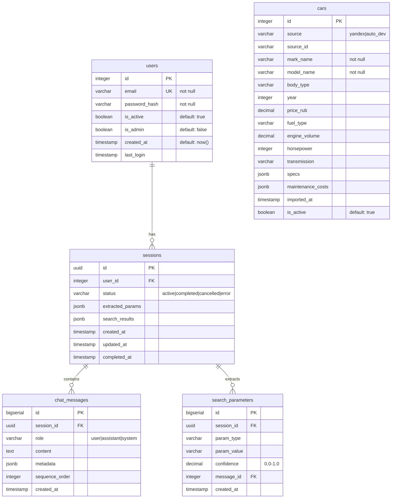

# **Техническое задание: Веб-приложение CarMatch**

## Оглавление
- [1. Описание сервиса и бизнес-задач](#1-описание-сервиса-и-бизнес-задач)
	- [1.1. Видение и миссия](#11-видение-и-миссия)
	- [1.2. Решаемая проблема](#12-решаемая-проблема)
	- [1.3. Целевая аудитория](#13-целевая-аудитория)
	- [1.4. Бизнес-цели (SMART)](#14-бизнес-цели-smart)
	- [1.5. Уникальное ценностное предложение](#15-уникальное-ценностное-предложение)
	- [1.6. Ключевые метрики успеха (KPI)](#16-ключевые-метрики-успеха-kpi)
	- [1.7. Основные гипотезы](#17-основные-гипотезы)
- [2. Описание ключевых разделов и функционала](#2-описание-ключевых-разделов-и-функционала)
	- [2.1. Пользовательские роли](#21-пользовательские-роли)
	- [2.2. Основные пользовательские сценарии](#22-основные-пользовательские-сценарии)
	- [2.3. Функциональные модули (MoSCoW)](#23-функциональные-модули-moscow)
	- [2.4. Wireframes](#24-wireframes)
	- [2.5. Внешние интеграции](#25-внешние-интеграции)
- [3. Описание структуры БД](#3-описание-структуры-бд)
	- [3.1. Полная ERD-диаграмма](#31-полная-erd-диаграмма)
	- [3.2. Детальное описание таблиц](#32-детальное-описание-таблиц)
	- [3.3. Логика работы данных](#33-логика-работы-данных)
	- [3.4. Миграции и наполнение данных](#34-миграции-и-наполнение-данных)
- [4. Технологии и методы взаимодействия](#4-технологии-и-методы-взаимодействия)
	- [4.1. Технологический стек](#41-технологический-стек)
	- [4.2. Архитектурная схема](#42-архитектурная-схема)
	- [4.3. API спецификация](#43-api-спецификация)
	- [4.4. Безопасность](#44-безопасность)
	- [4.5. Нефункциональные требования](#45-нефункциональные-требования)
	- [4.6. План развертывания](#46-план-развертывания)
	- [4.7. Дорожная карта разработки](#47-дорожная-карта-разработки)
	- [4.8. Риски и митигация](#48-риски-и-митигация)
- [5. Приложения](#5-приложения)
	- [5.1. Промпты и шаблоны](#51-промпты-и-шаблоны)
	- [5.2. Глоссарий](#52-глоссарий)
	- [5.3. Контакты и ответственные](#53-контакты-и-ответственные)

**Версия:** 1.1  
**Дата:** 25.01.2026  
**Статус:** На рассмотрении

---

## 1. Описание сервиса и бизнес-задач

### 1.1. Видение и миссия
**CarMatch** — это интерактивный AI-консультант по подбору автомобилей, который заменяет сложные формы фильтров естественным диалогом на русском языке.

**Миссия:** Сделать процесс выбора автомобиля таким же простым, как разговор с опытным другом-автолюбителем.

### 1.2. Решаемая проблема
- **Для пользователей:** Сложность формулировки точных требований к автомобилю через стандартные фильтры
- **Для бизнеса:** Высокий процент оттока пользователей на этапе сложных форм ввода
- **Рыночный разрыв:** Отсутствие русскоязычных AI-решений для подбора авто с контекстным диалогом

### 1.3. Целевая аудитория
| Группа | Характеристики | Потребности |
|--------|----------------|-------------|
| **Первичная:** Первомашина | Возраст 20-30 лет, бюджет 500к-1.5М руб | Простота, помощь в определении параметров |
| **Вторичная:** Семейный автомобиль | Возраст 30-45 лет, дети, бюджет 1.5М-3М руб | Безопасность, комфорт, практичность |
| **Третичная:** Смена автомобиля | Опытные водители, бюджет от 2М руб | Специфичные требования, сравнение с текущим авто |

### 1.4. Бизнес-цели (SMART)
**На 6 месяцев после запуска:**

**Количественные:**
1. Привлечь 5,000 зарегистрированных пользователей
2. Достичь конверсии в завершенный подбор 40%
3. Получить 2,000 подписок на email-рассылку
4. Сократить время подбора авто с 15 до 5 минут

**Качественные:**
1. Создать "wow-эффект" через естественный диалог
2. Сформировать базу предпочтений российских автопокупателей
3. Стать референсом в сегменте AI-консультантов

### 1.5. Уникальное ценностное предложение
1. **Контекстный диалог** — ИИ задает умные уточняющие вопросы
2. **Русский автоподбор** — Специфичная для РФ логика (пробег, ТО, нюансы рынка)
3. **Полный цикл** — От пожеланий до конкретных предложений с ценами
4. **Простота** — Никаких сложных форм и сотен фильтров

### 1.6. Ключевые метрики успеха (KPI)
| Метрика | Цель MVP | Цель Год |
|---------|----------|----------|
| Daily Active Users (DAU) | 100 | 500 |
| Конверсия в подбор | 30% | 45% |
| Средняя оценка (1-5) | 4.0 | 4.5 |
| Время до первого результата | < 3 мин | < 2 мин |
| Retention Rate (7 дней) | 25% | 40% |

### 1.7. Основные гипотезы
1. Естественный диалог увеличит завершенность подбора на 25%
2. Русскоязычный сленг повысит доверие на 15%
3. Подбор с учетом ТО снизит беспокойство о владении на 30%

[В начало](#техническое-задание-веб-приложение-carmatch)

---

## 2. Описание ключевых разделов и функционала

### 2.1. Пользовательские роли
| Роль | Доступ | Описание |
|------|--------|----------|
| **Пользователь** | Полный доступ к чату, история диалогов | Зарегистрированный клиент (обязательная регистрация) |
| **Администратор** | Управление контентом, просмотр статистики | Сотрудник компании |
| **Супер-админ** | Управление LLM-параметрами, доступ к логам | Технический специалист |

### 2.2. Основные пользовательские сценарии

#### Сценарий 1: Регистрация и первичный подбор
**Как** новый пользователь, **я хочу** зарегистрироваться и получить рекомендацию автомобиля, **чтобы** понять, что мне подходит.

**Поток событий:**
1. Пользователь заходит на сайт
2. Видит только форму регистрации/входа
3. Регистрируется (email/пароль)
4. После входа попадает в чат
5. Описывает потребности: "Нужна машина для города, экономная"
6. ИИ задает уточняющие вопросы
7. Извлекает 3+ параметра
8. Предлагает 3-5 вариантов автомобилей
9. Показывает детали по каждому (цена, ТО, фото)
10. Система сохраняет результат в историю

#### Сценарий 2: Сравнение вариантов
**Как** пользователь, **я хочу** сравнить несколько понравившихся автомобилей, **чтобы** принять окончательное решение.

#### Сценарий 3: Уточнение по обслуживанию
**Как** пользователь, **я хочу** узнать реальную стоимость владения, **чтобы** не попасть на дорогое ТО.

### 2.3. Функциональные модули (MoSCoW)

#### MVP (Must Have)
1. **Обязательная регистрация/авторизация**
2. **Чат-интерфейс** с историей сообщений
3. **AI-диалог** с извлечением параметров
4. **Подбор автомобилей** (базовая логика)
5. **Отображение результатов** (список + детали)
6. **Сохранение истории** диалогов

#### Расширение V1.1 (Should Have)
7. **Сравнение автомобилей**
8. **Расчет стоимости владения**
9. **Админка: управление каталогом**
10. **Базовая аналитика диалогов**

#### Будущие версии (Could Have)
11. **Интеграция с авто.ру**
12. **Рекомендации дилеров**
13. **Расширенная аналитика**

#### Не в scope (Won't Have)
14. **Гостевой режим**
15. **Telegram бот**
16. **Онлайн-покупка**
17. **Кредитный калькулятор**

### 2.4. Wireframes

#### Экран 1: Авторизация (единственный доступ без регистрации)
```
+-------------------------------------------------+
|               [Лого CarMatch]                  |
|                                                 |
|           Добро пожаловать в CarMatch          |
|                                                 |
|  Email: [_________________]                    |
|                                                 |
|  Пароль: [_________________]                   |
|                                                 |
|        [Войти]       [Зарегистрироваться]      |
|                                                 |
+-------------------------------------------------+
```

#### Экран 2: Чат-интерфейс (после входа)
```
+-------------------------------------------------+
| [Лого] CarMatch              [User] [Выйти]    |
+-------------------------------------------------+
| Sidebar:                                       |
| • Новый диалог                                 |
| • История:                                     |
|   - 25.03: Семейный авто                       |
|   - 24.03: Спортивная тачка                    |
|                                                 |
+-----------------+-------------------------------+
|                 | История чата:                |
|                 |                               |
|                 | User: Нужна машина для города |
|                 | Bot: Понял! Какой бюджет?    |
|                 |                               |
|                 | [Поле ввода] [Отправить]     |
|                 |                               |
+-----------------+-------------------------------+
```

### 2.5. Внешние интеграции
| Сервис | Назначение | Статус | Ссылка |
|--------|------------|--------|--------|
| **Yandex Auto Export** | Каталог автомобилей с характеристиками | Must | https://auto-export.s3.yandex.net/auto/price-list/catalog/cars.xml |
| **Auto.dev API** | Детальная информация по автомобилям | Should | https://www.auto.dev/ |
| **Dadata API** | Нормализация названий авто | Could | https://dadata.ru/api/ |

**Примечание:** Для MVP используем статический экспорт от Яндекса. В будущем можно подключить Auto.dev API для более детальной информации.

[В начало](#техническое-задание-веб-приложение-carmatch)

---

## 3. Описание структуры БД

### 3.1. Полная ERD-диаграмма


### 3.2. Детальное описание таблиц

#### Таблица `users`
```sql
CREATE TABLE users (
    id SERIAL PRIMARY KEY,
    email VARCHAR(255) UNIQUE NOT NULL,
    password_hash VARCHAR(255) NOT NULL,
    is_active BOOLEAN DEFAULT true,
    is_admin BOOLEAN DEFAULT false,
    created_at TIMESTAMP DEFAULT NOW(),
    last_login TIMESTAMP,
    login_count INTEGER DEFAULT 0
);

-- Индексы
CREATE INDEX idx_users_email ON users(email);
CREATE INDEX idx_users_created_at ON users(created_at);
CREATE INDEX idx_users_is_active ON users(is_active) WHERE is_active = true;
```

#### Таблица `cars` (каталог из Yandex Auto Export)
```sql
CREATE TABLE cars (
    id SERIAL PRIMARY KEY,
    -- Источник данных
    source VARCHAR(20) NOT NULL DEFAULT 'yandex',
    source_id VARCHAR(100),  -- ID в исходном каталоге
    
    -- Основные характеристики (из Yandex XML)
    mark_name VARCHAR(100) NOT NULL,
    model_name VARCHAR(100) NOT NULL,
    body_type VARCHAR(50),
    year INTEGER,
    price_rub DECIMAL(12,2),
    
    -- Технические параметры
    fuel_type VARCHAR(30),
    engine_volume DECIMAL(4,2),
    horsepower INTEGER,
    transmission VARCHAR(30),
    
    -- Дополнительные данные
    color VARCHAR(50),
    drive_type VARCHAR(30),
    
    -- Метаданные
    specs JSONB DEFAULT '{}',
    images TEXT[],  -- массив URL изображений
    description TEXT,
    
    -- Флаги и временные метки
    is_active BOOLEAN DEFAULT true,
    imported_at TIMESTAMP DEFAULT NOW(),
    updated_at TIMESTAMP DEFAULT NOW(),
    
    -- Ограничения
    CONSTRAINT chk_year CHECK (year BETWEEN 1990 AND EXTRACT(YEAR FROM NOW()) + 1),
    CONSTRAINT chk_price CHECK (price_rub > 0)
);

-- Индексы для поиска
CREATE INDEX idx_cars_mark_model ON cars(mark_name, model_name);
CREATE INDEX idx_cars_year ON cars(year);
CREATE INDEX idx_cars_price ON cars(price_rub);
CREATE INDEX idx_cars_body_type ON cars(body_type);
CREATE INDEX idx_cars_fuel_type ON cars(fuel_type);
CREATE INDEX idx_cars_is_active ON cars(is_active) WHERE is_active = true;
```

#### Таблица `sessions`
```sql
CREATE TABLE sessions (
    id UUID PRIMARY KEY DEFAULT gen_random_uuid(),
    user_id INTEGER REFERENCES users(id) ON DELETE CASCADE,
    
    -- Статус и прогресс
    status VARCHAR(20) DEFAULT 'active' 
        CHECK (status IN ('active', 'completed', 'cancelled', 'error')),
    
    -- Извлеченные параметры (кеширование)
    extracted_params JSONB DEFAULT '{}',
    search_criteria JSONB DEFAULT '{}',
    search_results JSONB DEFAULT '[]',
    
    -- Временные метки
    created_at TIMESTAMP DEFAULT NOW(),
    updated_at TIMESTAMP DEFAULT NOW(),
    completed_at TIMESTAMP,
    
    -- Статистика
    message_count INTEGER DEFAULT 0,
    parameters_count INTEGER DEFAULT 0,
    cars_found INTEGER DEFAULT 0
);

CREATE INDEX idx_sessions_user_id ON sessions(user_id);
CREATE INDEX idx_sessions_status ON sessions(status);
CREATE INDEX idx_sessions_created_at ON sessions(created_at);
```

### 3.3. Логика работы данных

#### Процесс подбора автомобиля:
1. **Инициализация сессии** - создание записи в `sessions`
2. **Сбор параметров** - сохранение в `search_parameters` через диалог
3. **Поиск в каталоге** - запрос к `cars` с фильтрами
4. **Ранжирование результатов** - расчет релевантности
5. **Кеширование результатов** - сохранение в `sessions.search_results`

#### Пример SQL запроса для поиска:
```sql
SELECT * FROM cars 
WHERE 
    is_active = true 
    AND price_rub <= :budget_max
    AND body_type = :body_type
    AND year >= :min_year
    AND fuel_type = :fuel_type
ORDER BY 
    CASE 
        WHEN mark_name = :preferred_mark THEN 0 
        ELSE 1 
    END,
    price_rub ASC
LIMIT 10;
```

### 3.4. Миграции и наполнение данных

#### Начальное наполнение каталога:
```python
# Парсинг Yandex Auto Export XML
def import_yandex_catalog(xml_url):
    # 1. Загрузка XML файла
    # 2. Парсинг структуры
    # 3. Преобразование в структуру БД
    # 4. Сохранение в таблицу cars
    pass
```

#### Планируемый объем данных:
- **Автомобили:** ~10,000 записей (из Yandex каталога)
- **Пользователи:** до 5,000
- **Сессии:** до 50,000
- **Сообщения:** до 500,000

[В начало](#техническое-задание-веб-приложение-carmatch)

---

## 4. Технологии и методы взаимодействия

### 4.1. Технологический стек

#### Frontend
| Компонент | Технология | Обоснование |
|-----------|------------|-------------|
| **Фреймворк** | React 18+ | Стандарт индустрии, TypeScript поддержка |
| **Стилизация** | CSS Modules | Локальная область видимости, простота поддержки |
| **Состояние** | Redux Toolkit | Управление состоянием, devtools, TypeScript |
| **Роутинг** | React Router v6 | Де-факто стандарт для SPA |
| **Запросы** | Axios + React Query | HTTP клиент, кэширование запросов |
| **Чат-компоненты** | Custom WebSocket | Полный контроль над логикой чата |
| **Сборка** | Vite | Быстрая сборка, HMR, современный tooling |
| **Язык** | TypeScript | Типизация, меньше ошибок |

#### Backend
| Компонент | Технология | Обоснование |
|-----------|------------|-------------|
| **Фреймворк** | FastAPI (Python) | Быстрота, асинхронность, автоматическая документация |
| **БД** | PostgreSQL (бесплатные облачные варианты) | Надежность, JSONB, бесплатные тарифы |
| **ORM** | SQLAlchemy 2.0 + Alembic | Зрелость, миграции, Type hints |
| **Кэш** | Redis (если потребуется) | Сессии, кэширование |
| **Очереди** | Celery (для фоновых задач) | Обновление каталога, аналитика |
| **AI инференс** | Ollama + Qwen2.5 | Локальный запуск, оптимизация |
| **Аутентификация** | JWT tokens | Стандарт для SPA |

#### Бесплатный хостинг (варианты):
| Сервис | Для чего | Ограничения |
|--------|----------|-------------|
| **Vercel** | Frontend React | Бесплатно, автоматические деплои |
| **Render** | Backend FastAPI | Бесплатный tier, PostgreSQL |
| **Supabase** | PostgreSQL + Auth | Бесплатно до 500MB, аутентификация |
| **Railway** | Backend + БД | $5 кредит в месяц, потом платно |
| **GitHub Pages** | Frontend | Бесплатно, только статика |

**Рекомендуемая конфигурация для старта:**
- **Frontend:** Vercel (бесплатно)
- **Backend:** Render (бесплатный tier)
- **Database:** Supabase PostgreSQL (бесплатно)
- **AI модель:** Локально на Render (в рамках контейнера)

### 4.2. Архитектурная схема
```
┌─────────────────┐    HTTPS/WSS    ┌─────────────────┐
│   Браузер       │◄───────────────►│   Vercel        │
│   (React SPA)   │                 │   (Frontend)    │
└─────────────────┘                 └─────────────────┘
                                          │
                                          │ API calls
                                          ▼
┌─────────────────────────────────────────────────────┐
│                   Render.com                        │
│  ┌─────────────┐  ┌─────────────┐  ┌─────────────┐ │
│  │  FastAPI    │  │   Ollama    │  │   Celery    │ │
│  │   App       │◄─┤   (Qwen)    │  │   Worker    │ │
│  └─────────────┘  └─────────────┘  └─────────────┘ │
│          │                │                │        │
│          ▼                ▼                ▼        │
│  ┌──────────────────────────────────────────────┐  │
│  │           PostgreSQL (Supabase)              │  │
│  └──────────────────────────────────────────────┘  │
└─────────────────────────────────────────────────────┘
```

### 4.3. API спецификация

#### Базовый URL: `https://api.carmatch.app/v1`

#### Эндпоинты:

##### Авторизация
```http
POST /auth/register
Content-Type: application/json

{
  "email": "user@example.com",
  "password": "securepassword123"
}

Response:
{
  "access_token": "jwt_token_here",
  "user_id": 1,
  "email": "user@example.com"
}
```

##### Чат-сессии
```http
POST /chat/sessions
Authorization: Bearer {token}

Response:
{
  "session_id": "uuid-here",
  "created_at": "2024-03-27T10:00:00Z"
}

WebSocket: wss://api.carmatch.app/ws/chat/{session_id}
```

##### Поиск автомобилей
```http
GET /cars/search?budget_max=2000000&body_type=suv&limit=5
Authorization: Bearer {token}

Response:
{
  "count": 3,
  "results": [
    {
      "id": 1,
      "mark_name": "Toyota",
      "model_name": "RAV4",
      "year": 2022,
      "price_rub": 2100000,
      "body_type": "suv",
      "fuel_type": "hybrid",
      "images": ["url1", "url2"]
    }
  ]
}
```

### 4.4. Безопасность

#### Основные меры:
1. **HTTPS везде** - обязательно для всех сервисов
2. **JWT аутентификация** - access/refresh tokens
3. **Хеширование паролей** - bcrypt с salt
4. **CORS политика** - только trusted domains
5. **Rate limiting** - 60 запросов/минуту на пользователя
6. **SQL injection protection** - через ORM/параметризованные запросы

#### Конфигурация FastAPI security:
```python
from fastapi import Depends, FastAPI, HTTPException
from fastapi.security import HTTPBearer, HTTPAuthorizationCredentials

security = HTTPBearer()

async def get_current_user(
    credentials: HTTPAuthorizationCredentials = Depends(security)
):
    # Валидация JWT токена
    # Проверка пользователя в БД
    return user
```

### 4.5. Нефункциональные требования

#### Производительность:
| Метрика | Требование | Мониторинг |
|---------|------------|------------|
| **Время ответа ИИ** | < 4 секунд | 95 перцентиль |
| **Поиск автомобилей** | < 1 секунды | Среднее время |
| **Загрузка SPA** | < 3 секунд | Lighthouse |
| **Availability** | 99% uptime | UptimeRobot |
| **Concurrent users** | 50+ | Пиковая нагрузка |

#### Масштабируемость:
1. **Статический фронтенд** - легко масштабируется (Vercel)
2. **Бэкенд без состояния** - горизонтальное масштабирование
3. **Кэширование запросов** - Redis для частых запросов
4. **Асинхронные задачи** - Celery для фоновых операций

### 4.6. План развертывания

#### Этап 1: Локальная разработка
```bash
# Клонирование репозитория
git clone https://github.com/username/carmatch.git

# Запуск через Docker Compose
docker-compose -f docker-compose.dev.yml up

# Миграции БД
docker-compose exec backend alembic upgrade head
```

#### Этап 2: Staging окружение (Render)
1. Подключение GitHub репозитория к Render
2. Настройка environment variables
3. Автоматический деплой при push в develop ветку
4. Тестирование на staging URL

#### Этап 3: Production (Vercel + Render)
1. **Frontend:** Vercel (из GitHub)
2. **Backend:** Render Web Service
3. **Database:** Supabase PostgreSQL
4. **Домен:** Настройка кастомного домена

### 4.7. Дорожная карта разработки

#### Месяц 1: MVP Core
**Недели 1-2:** Базовая инфраструктура
- [ ] Настройка репозитория (frontend/backend)
- [ ] Базовая аутентификация (регистрация/вход)
- [ ] Простейший чат-интерфейс

**Недели 3-4:** AI интеграция
- [ ] Настройка Ollama с Qwen2.5
- [ ] Логика извлечения параметров из диалога
- [ ] Парсинг Yandex каталога автомобилей

**Недели 5-6:** Поиск и результаты
- [ ] Поисковая система по каталогу
- [ ] Отображение результатов
- [ ] Сохранение истории диалогов

**Недели 7-8:** Полировка
- [ ] Тестирование
- [ ] Оптимизация производительности
- [ ] Деплой на staging

#### Месяц 2: Улучшения
- [ ] Админ-панель
- [ ] Расчет стоимости владения
- [ ] Улучшенный поиск
- [ ] Интеграция с Auto.dev API

#### Месяц 3: Масштабирование
- [ ] Кэширование
- [ ] Мониторинг
- [ ] Улучшения UX

### 4.8. Риски и митигация

| Риск | Вероятность | Влияние | Меры митигации |
|------|-------------|---------|----------------|
| **Ограничения бесплатного хостинга** | Высокая | Среднее | Мониторинг лимитов, готовность к миграции |
| **Производительность ИИ** | Средняя | Высокое | Кэширование ответов, оптимизация промптов |
| **Качество данных каталога** | Средняя | Среднее | Регулярное обновление, fallback на Auto.dev |
| **Отсутствие пользователей** | Средняя | Высокое | Маркетинг, referral программа |
| **Технические сложности** | Низкая | Среднее | Поэтапная разработка, тестирование |

[В начало](#техническое-задание-веб-приложение-carmatch)

---

## 5. Приложения

### 5.1. Промпты и шаблоны

#### System Prompt для Qwen2.5:
```text
Ты — AI-консультант CarMatch, русскоязычный эксперт по подбору автомобилей.

Твоя задача:
1. В дружелюбном тоне помочь пользователю сформулировать критерии
2. Извлекать параметры для поиска из диалога
3. Задавать уточняющие вопросы по приоритетным параметрам
4. После сбора 3+ параметров предлагать поиск

Ключевые параметры для сбора (по приоритету):
1. Бюджет (в рублях)
2. Тип кузова (седан, внедорожник, хэтчбек, универсал)
3. Год выпуска (минимум)
4. Тип топлива (бензин, дизель, гибрид, электро)
5. Коробка передач (автомат, механика)

Стиль общения:
- Используй разговорный русский язык
- Можешь использовать автожаргон уместно
- Будь внимательным к деталям
- Уточняй, если что-то непонятно

Формат вывода (JSON):
{
  "response": "Твой ответ пользователю",
  "extracted_params": [
    {"type": "budget_max", "value": "2000000", "confidence": 0.9}
  ],
  "needs_clarification": ["тип кузова"],
  "ready_for_search": false
}
```

#### Пример диалога:
```
Пользователь: Ищу машину до 2 миллионов
AI: Понял, бюджет до 2 млн рублей. Отличный выбор! 
    Для каких задач нужна машина: для города, семьи, или может для поездок за город?

JSON ответа:
{
  "response": "Понял, бюджет до 2 млн рублей. Отличный выбор! Для каких задач нужна машина: для города, семьи, или может для поездок за город?",
  "extracted_params": [
    {"type": "budget_max", "value": "2000000", "confidence": 0.95}
  ],
  "needs_clarification": ["body_type"],
  "ready_for_search": false
}
```

### 5.2. Глоссарий

| Термин | Определение |
|--------|-------------|
| **Сессия** | Один диалог пользователя с ботом от начала до получения результатов |
| **Параметр** | Критерий поиска, извлеченный из диалога (бюджет, тип кузова и т.д.) |
| **Yandex Auto Export** | Бесплатный каталог автомобилей от Яндекса в XML формате |
| **Ollama** | Фреймворк для запуска LLM моделей локально |
| **Qwen2.5** | Многоязычная LLM модель от Alibaba, хорошо работает с русским |
| **CSS Modules** | Подход к CSS, где стили локальны для каждого компонента |

### 5.3. Контакты и ответственные

| Роль | Ответственный | Контакты |
|------|---------------|----------|
| **Product Owner** | Иван Петров | ivan@carmatch.ru |
| **Frontend Lead** | Алексей Смирнов | alexey@carmatch.ru |
| **Backend/AI Engineer** | Мария Иванова | maria@carmatch.ru |

---

### Ключевые моменты для реализации:
1. **Обязательная регистрация** - сразу собираем базу пользователей
2. **Бесплатный стек** - Vercel (frontend) + Render (backend) + Supabase (DB)
3. **Локальный AI** - Ollama с Qwen2.5 для контроля стоимости
4. **CSS Modules** - простота поддержки, изоляция стилей

**Документация готова к старту разработки.** Рекомендуется начать с настройки репозитория и базовой инфраструктуры.

[В начало](#техническое-задание-веб-приложение-carmatch)